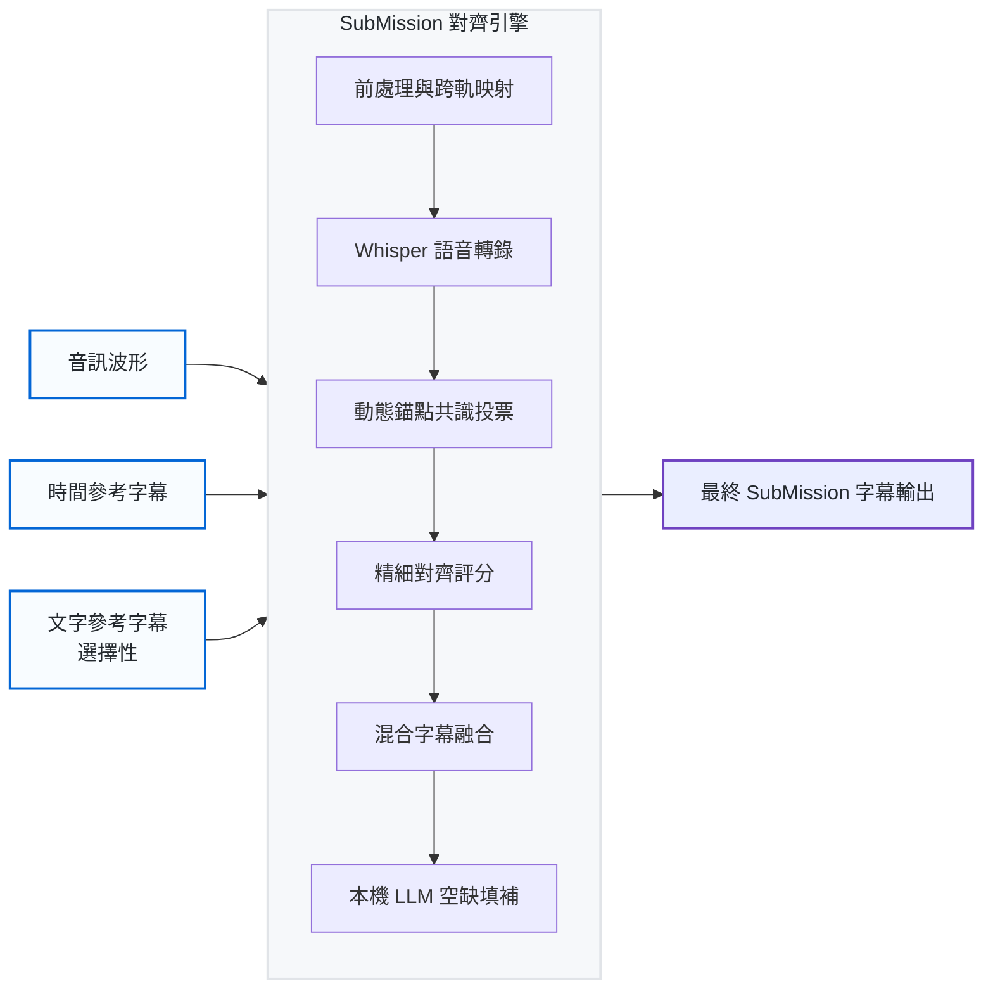
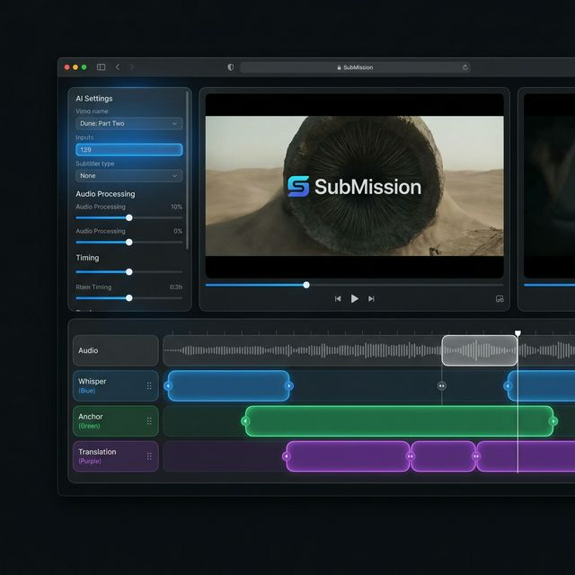

<div align="center">
  <h1>🎬 SubMission</h1>
  <p><i>次世代字幕對齊與融合管線。結合人類語感節奏與 AI 語音聲學精準度。</i></p>
  <p>
    <b>🇹🇼 繁體中文</b> | <a href="README_en.md">🇬🇧 English</a>
  </p>
</div>

<br />

## 🚀 專案願景與核心定位：為「臺式在地化」而生

**SubMission**（前身為 `smart-subtitle`）的誕生，是為了解決影音在地化翻譯中最棘手的難題：**如何在不遺漏任何一句對白、不打亂翻譯者苦心安排的閱讀節奏的情況下，將字幕與語音時間軸做到「毫秒級」的完美同步。**

這項專案的架構設計與模型選擇（例如：採用 `Llama-3-Taiwan-8B-Instruct` 語言模型、實作 Lexical Early-Binding），都是**專門針對「繁體中文（臺灣）」的影視在地化流程所量身打造的**。

在實務上，多數人最常面臨的在地化情境是：
* 手邊有一份**時間軸完美**（例如官方發行的 Web-DL 或藍光版），但翻譯生硬或充滿外來用語的官方字幕。
* 同時又有一份**翻譯極佳、深具在地語感**（例如用心製作的粉絲字幕），但時間軸因為片源不同（例如影格率差異或片頭無聲片段不同）而對不上。

SubMission 完美解決了這個基礎痛點。它採用了 **「字幕本位混合架構 (Subtitle-Led Hybrid Architecture)」**。你可以直接餵給它那份「時間完美但翻譯差的字幕」與「時間亂掉但翻譯極佳的字幕」，SubMission 會透過跨語系字面映射 (Lexical Cross-Mapping)、AI 語音聲學錨點 (Acoustic Anchoring) 與語意分析，將兩者天衣無縫地融合為一份**時間軸準確且用字道地的完美字幕母帶**。

更強大的是，SubMission 針對各種極端情況 (Edge Cases) 具備了極高的強健性 (Robustness)。如果傳統對齊工具（如 alass）遇到廣告切口、刪減片段或翻譯順序不同時，通常會發生災難性的對齊錯亂。但無論你處理的影片是**含有額外廣告休息區段的電視廣播版**、**加入了新片段的導演剪輯版**，或是**兩句台詞被合併成一句的重度在地化翻譯**，SubMission 的動態錨點演算法都能游刃有餘地處理。

### ✨ 核心技術與特色

* **無懼時間軸飄移 (動態錨點演算法)：** 捨棄了容易崩潰的「全局時間平移」作法。SubMission 透過比對 Whisper 逐字稿與人類字幕，演算出「滑動視窗偏差共識 (Sliding Window Offset Consensus)」。它會為整部影片建立一張數學對齊地形圖，讓你的字幕面對突如其來的廣告切口或不同剪輯版本時，依然穩如泰山。
* **詞彙及早綁定 (跨軌字面映射技術)：** 在進行語音對齊前，系統會預先在長達 5 分鐘的同步視窗內，使用 `rapidfuzz` 將兩份字幕軌道進行掃描。這能完美地將「繁體台灣慣用語」直接覆蓋到「簡體時間軸」的正確位置上。
* **零對白遺漏 (字幕本位迭代)：** 語音活動檢測 (VAD) 常在背景音樂吵雜或特效音時失效。不同於傳統工具盲目依賴 Whisper 片段（很容易漏掉沒聽清楚的台詞），SubMission 堅持以你的**原始人類字幕行為單位**進行遍歷，保證 100% 的句子與結構留存率。
* **語意間隙守門員 (Semantic Gap Policy)：** 為了不破壞人類的閱讀步調，系統會精算句子與句子之間的「對話間隙 (Conversational Gap)」，若某個數學對齊候選者會導致閱讀節奏崩潰，系統將予以懲罰並拒絕套用該不合理的對齊。
* **時序單調性護欄 (Chronological Monotonicity)：** 嚴格的數學結構保護機制，從物理上杜絕字幕為了貪圖相似度而「時光倒流」或順序錯亂。
* **本機 LLM 漏洞修補：** 利用本機模型（Ollama / Llama-3-Taiwan）自動將 Whisper 聽得出但人類字幕完全漏翻的背景閒聊進行補譯。

---

## 🏗️ 技術架構

SubMission 透過嚴謹的數學與時序護欄來約束機器學習可能產生的幻覺 (Hallucinations)。不論是單檔優化或多檔融合，都會經過 **SubMission Alignment Engine (對齊引擎)** 的淬鍊。



## 🖥️ 互動式 Web UI 介面

因為完美的字幕對齊有時需要針對不同素材進行參數微調，SubMission 直接在 Python CLI 工具中內建了一個無依賴項 (Zero-dependency) 的全端 Web 視覺化應用程式：

1. **後端 API (`FastAPI`)**：整合在 `smart-subtitle ui` 指令中，負責提供 REST 端點以觸發 Python 轉錄與對齊執行緒，同時伺服靜態前端資源。
2. **前端介面 (`React / Vite`)**：一套高效能、採用玻璃擬物化 (Glassmorphism) 設計的動態時間軸視覺化工具。
    * 提供受約束的拖曳操作：使用者能物理性地拖拉字幕區塊來微調，但碰撞引擎會確保字幕不會穿透或破壞時序規則。
    * 提供物理分層的視覺化：讓你直接肉眼觀察「語意錨點」如何完美貼合在 Whisper 聲學邊界之上。

<div align="center">
  
</div>

<div align="center">
    <i>啟動互動式時間軸伺服器只需一行指令：</i><br>
    <code>smart-subtitle ui</code>
</div>

## ⚙️ 運作原理 (7 階段管線)

1. **音訊萃取與前處理**：擷取 16kHz 單聲道音源。我們可選擇開啟「跨軌映射 (`bilingual_cross_match_strategy = "lexical"`)」，將高純度的臺灣在地化文字無縫覆蓋至主時軌上。
2. **語音轉錄 (Whisper)**：執行 `faster-whisper`，強制要求 `word_timestamps=True` 並強勢阻擋 `condition_on_previous_text=False`，防止模型在長時間靜音區段產生文字幻覺。
3. **基準翻譯建立**：使用專注於繁中的 `Llama-3-Taiwan-8B` 等 LLM 將不同語言的語音區塊翻譯成基準文字，搭起文字相似度的比對橋樑。
4. **動態錨點映射 (Dynamic Anchor Mapping)**：引擎的靈魂。利用結合了「3 法則」(連續三句高信心度配對) 的滑動視窗演算法，求出影片因剪輯差異而產生的非線性絕對時差。
5. **精細對齊 (Fine Alignment)**：核心 `TextMatcher` 評分引擎。會將「時序單調性」、「毫秒時間懲罰」與「字串相似度」放進天平中計算最高適配度。
6. **字幕融合 (Merge Stage)**：定案最終字串。結合 Whisper 精準的「發聲起點」以及人類字幕原本的「講話時長」，徹底解決 AI 字幕容易出現的「尾音殘留 (Trailing Whisper artifacts)」問題。
7. **空缺填補 (Gap Filling)**：如果發現 Whisper 轉錄出了某段人類原本 `.srt` 中完全沒有的隱藏對白，呼叫臺灣大語言模型立即翻譯填補。

## 📦 安裝與硬體設定指引

### 硬體加速 (針對 Intel Arc GPU 用戶)
SubMission 深度整合了在地化 LLM 語意分析。儘管多數運作架構以 NVIDIA CUDA 為主，但本專案針對 **Intel Arc Pro B60 24GB GPU** 進行了極限優化與長期測試：
* **核心對齊運算**：建議在標準 CPU 多執行緒環境下直接執行 `faster-whisper`。（雖然曾測試過 OpenVINO，但在處理音訊串流時發現 SYCL 驅動層級仍有 deadlock 穩定性疑慮）。
* **LLM 後端推論**：透過 `Ollama` 載入 `Llama-3-Taiwan-8B-Instruct`。
* **Arc 關鍵環境變數設定**：在特定 Linux 核心或 Intel Arc 驅動下運作 Ollama 時，如果發生 `sycl` 執行緒崩潰 (`exit status 2`)，你**必須**強制繞過 Ollama 封裝的 `.so` 函式庫，改用 host 系統的 `intel-basekit` 執行環境。請將以下環境變數寫入你的系統 (或 `.bashrc`) 即可在 Arc GPU 上飆出超過 60 tokens/s 的推論速度：
```bash
export OLLAMA_LLM_LIBRARY="system"
export ZES_ENABLE_SYSMAN=1
export SYCL_PI_LEVEL_ZERO_USE_IMMEDIATE_COMMANDLISTS=1
export NEOReadDebugKeys=1
export DisableScratchSpace=1
```

### 1. 建立虛擬環境 (Virtual Environment)
```bash
python3 -m venv .venv
source .venv/bin/activate
pip install -e .
```

### 2. 安裝備用對齊系統
確保系統 PATH 中有安裝 `alass`，作為萬不得已的全局對齊備案工具（同時確保 ffmpeg 已安裝）：
```bash
sudo apt-get install ffmpeg
```

### 3. 執行管線 (CLI 終端機)
輕鬆將主時間軸（簡體）與在地化文字（繁體）完美融為一體：
```bash
smart-subtitle align tests/video1/clip.mkv tests/video1/simplified_timing.srt tests/video1/traditional_text.srt -o output.srt
```

## ⚖️ 鳴謝與開源授權 (Acknowledgments & Licenses)

SubMission 建立在許多極優秀的開源專案之上。使用本專案時請遵守其各自的開源授權條款：

* **Llama-3-Taiwan-8B-Instruct**：非常感謝台大自然語言處理實驗室 (NTU NLP Lab) 與開源社群提供此模型，專為臺灣繁體中文語境優化。該模型使用 **Meta Llama 3 Community License**。
* **faster-whisper, rapidfuzz, FastAPI, Pydantic, React, Vite**：採用 **MIT License**。
* **OpenCC (opencc-python-reimplemented)**：採用 **Apache 2.0 License**。
