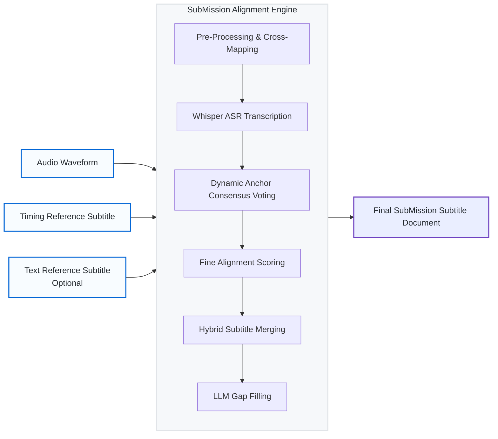

<div align="center">
  <h1>🎬 SubMission</h1>
  <p><i>A next-generation subtitle alignment and merging pipeline. Hybridizing human pacing with AI acoustic precision.</i></p>
</div>

<br />

## 🚀 The Mission

**SubMission** (formerly `smart-subtitle`) was built to solve the hardest problem in video translation and localization media processing: **synchronizing human-translated subtitle pacing with exact spoken audio timings without drifting or dropping lines.** 

Traditional alignment tools attempt to shift subtitles mathematically by analyzing voice activity, but they often fail catastrophically when presented with missing dialogue, commercial breaks, or localization edits. AI models like Whisper provide perfect timing, but output mechanical, un-styled text blocks that ruin the intended reading pace of a human translator.

SubMission bridges this gap. It operates on a **Subtitle-Led Hybrid Architecture**. If you provide a perfectly timed subtitle file with mediocre translations, and a poorly timed subtitle file with amazing localizations, SubMission leverages local LLM semantics, acoustic analysis, and lexical cross-mapping to seamlessly fuse them into a single flawless **Master Subtitle Track**.

### ✨ Core Capabilities

* **Immunity to Time/Sync Drift:** By using a "Sliding Window Continuity Algorithm" instead of global offsets, it safely aligns subtitles even if the video has newly inserted commercial breaks.
* **Lexical Early-Binding (Cross-Mapping):** Natively maps regional dialects (e.g. Traditional Taiwanese Mandarin onto Mainland Simplified) by scanning for strings with `rapidfuzz` across massive 5-minute synchronization windows.
* **Semantic Gap Policy:** Smoothly interpolates subtitle timings during complex overlaps by rejecting mathematically unsafe alignments unless textual similarity approaches `1.0`.
* **Zero Lost Dialogue:** Iterates fundamentally over the original *Human Subtitle Lines* rather than Whisper segments to guarantee 100% structural retention.
* **LLM Gap Filling:** Automatically translates any untranslated background chatter via local models (Ollama/Llama-3).

---

## 🏗️ Technical Architecture

SubMission avoids flashy AI hallucinations by enforcing rigid mathematical guardrails alongside its Machine Learning outputs. Both single-file and multi-file workflows pass through the **SubMission Alignment Engine**.



## 🛠️ Interactive Web UI

The project contains a zero-dependency bundled React / Vite graphical user interface to visualize the pipeline alignment logs and modify parameters dynamically. It allows visual timeline dragging, parameter updating, and live sync playback.

<div align="center">
    <i>Launch the interactive timeline visualization server:</i><br>
    <code>smart-subtitle ui</code>
</div>

## ⚙️ How it Works (The 7-Stage Pipeline)

1. **Extraction & Preprocessing**: Extracts 16kHz audio. Optionally performs Lexical Cross-Mapping to inject localized text variants onto the master timing track.
2. **Transcription**: Runs `faster-whisper` on the local machine with aggressive word-level tracking.
3. **Reference Translation**: Passes foreign audio segments into an LLM (e.g., Llama-3) to create a baseline semantic bridge.
4. **Dynamic Anchor Mapping**: Uses a Sliding Window Consensus Algorithm to calculate absolute offsets, immunizing the pipeline against drastic sync drifts like commercial breaks.
5. **Fine Alignment**: The core `TextMatcher` scoring engine. Evaluates Monotonicity, Time Penalties, and Textual Similarity.
6. **Merge Stage (The Hybrid Backbone)**: Locks down the final string by injecting the highest-priority localized text into the newly anchored Audio Segment.
7. **Gap Filling**: Translates any Whisper audio segments that totally lacked human-provided subtitles.

## � Installation & Execution

#### 1. Setup Virtual Environment
```bash
python3 -m venv .venv
source .venv/bin/activate
pip install -e .
```

#### 2. Install Alignment Tool
Ensure `alass` is accessible on your system PATH for legacy global alignment fallback:
```bash
sudo apt-get install ffmpeg
```

#### 3. Run Pipeline (CLI)
Align a primary timing track (e.g., Simplified) with a preferred linguistic track (e.g., Traditional) effortlessly:
```bash
smart-subtitle align tests/video1/clip.mkv tests/video1/simplified_timing.srt tests/video1/traditional_text.srt -o output.srt
```
