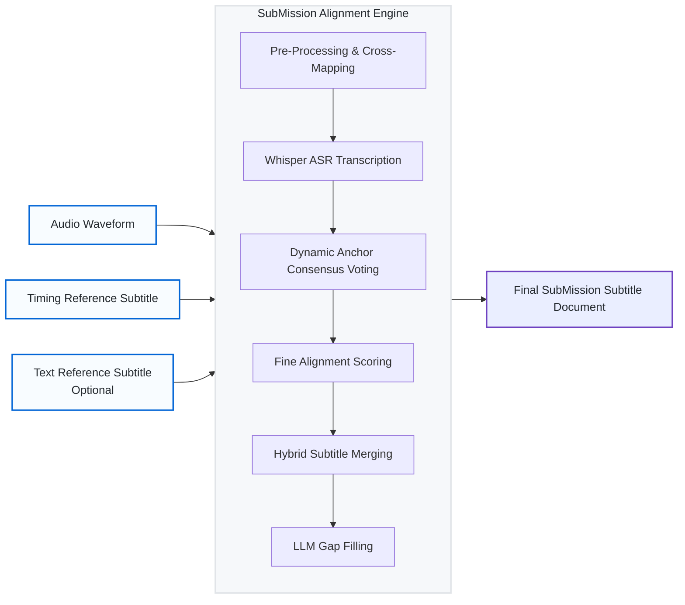

<div align="center">
  <h1>🎬 SubMission</h1>
  <p><i>A next-generation subtitle alignment and merging pipeline. Hybridizing human pacing with AI acoustic precision.</i></p>
  <p>
    <a href="README.md">🇹🇼 繁體中文</a> | <b>🇬🇧 English</b>
  </p>
</div>

<br />

## 🚀 The Mission

**SubMission** (formerly `smart-subtitle`) was built to solve the hardest problem in video translation and localization media processing: **synchronizing human-translated subtitle pacing with exact spoken audio timings without drifting or dropping lines.** 

In practice, the most common localization workflow looks like this:
* You have a **perfectly timed subtitle track** (e.g., from an official Web-DL or Blu-ray release), but the translation is overly literal, mechanical, or poorly localized.
* You also have a **beautifully translated, highly localized subtitle track** (e.g., a dedicated fan translation), but the timings are completely misaligned due to different framerates or alternate intro sequences.

SubMission solves this exact problem. It operates on a **Subtitle-Led Hybrid Architecture**. If you provide the "perfectly timed but poorly translated" subtitle alongside the "poorly timed but perfectly translated" subtitle, SubMission leverages local LLM semantics, acoustic analysis, and lexical cross-mapping to seamlessly fuse them into a single flawless **Master Subtitle Track**.

Beyond this standard use case, SubMission is built with extreme robustness against edge cases. While traditional alignment tools fail catastrophically when encountering missing dialogue, SubMission handles it all. Whether you are dealing with **TV broadcasts containing extra commercial breaks**, **Director's Cuts with newly added scenes**, or **heavy localization edits** where two human translation lines were merged into one, SubMission's dynamic anchor consensus maps it beautifully without dropping lines.

### ✨ Core Capabilities

* **Immunity to Time/Sync Drift (Dynamic Anchoring):** Escapes the trap of naïve global time-shifting. By analyzing the overlap between Whisper's transcription and your human subtitle, SubMission calculates a "Sliding Window Offset Consensus". This creates a mathematical map of your video, absorbing sudden commercial breaks, missing scenes, and different TV/Web-DL cuts effortlessly.
* **Lexical Early-Binding (Cross-Mapping):** Natively maps regional dialects (e.g. Traditional Taiwanese Mandarin onto Mainland Simplified) by scanning for strings with `rapidfuzz` across massive 5-minute synchronization windows perfectly before audio alignment even begins.
* **Zero Lost Dialogue (Subtitle-Led Iteration):** Voice Activity Detection (VAD) algorithms frequently fail during loud music or background noise. Instead of iterating blindly over Whisper segments (and dropping lines), SubMission iterates purely over your *Original Human Subtitle lines*, ensuring 100% structural and conversational retention.
* **Semantic Gap Policy:** Smoothly interpolates subtitle timings during complex overlaps by computing the human-authored conversational gap between sentences and punishing matches that violate intended reading pace.
* **Chronological Monotonicity Guardrails:** A strict structural rule that physically prevents greedily snapping subtitles out of their sequential order array.
* **LLM Gap Filling:** Automatically translates any untranslated background chatter via local models (Ollama/Llama-3).

---

## 🏗️ Technical Architecture

SubMission avoids flashy AI hallucinations by enforcing rigid mathematical guardrails alongside its Machine Learning outputs. Both single-file and multi-file workflows pass through the **SubMission Alignment Engine**.



## �️ Interactive Web UI Stack

Because SubMission requires extreme parameter tuning for varying video types, it bundles a zero-dependency full-stack web application directly inside the Python CLI:

1. **Backend API (`FastAPI`)**: Embedded inside the `smart-subtitle ui` command, it exposes REST endpoints to trigger Python transcription and alignment threads while serving static assets natively. 
2. **Frontend UI (`React / Vite`)**: A high-performance, glassmorphism-styled timeline visualizer.
    * Allows constraint-based drag manipulation of subtitles (physics snap blocks without breaking chronological constraints).
    * Features physical layer visualization showing semantic Anchor linkage mapped onto the Whisper boundaries.

<div align="center">
  
</div>

<div align="center">
    <i>Launch the interactive timeline visualization server:</i><br>
    <code>smart-subtitle ui</code>
</div>

## ⚙️ How it Works (The 7-Stage Pipeline)

1. **Extraction & Preprocessing**: Extracts 16kHz audio. Optionally performs Lexical Cross-Mapping (`bilingual_cross_match_strategy = "lexical"`) to inject localized text variants onto the exact timings of the master track.
2. **Transcription**: Runs `faster-whisper` requesting `word_timestamps=True` and aggressively enforcing `condition_on_previous_text=False` to prevent model hallucination over quiet spans.
3. **Reference Translation**: Passes foreign audio segments into an LLM (e.g., Llama-3-Taiwan-8B) to create a baseline semantic bridge.
4. **Dynamic Anchor Mapping**: The heart of the engine. Uses a Sliding Window Consensus Algorithm combining the "Rule of 3" (3 sequential, highly confident string matches) to calculate absolute non-linear semantic offsets. 
5. **Fine Alignment**: The `TextMatcher` scoring engine. Evaluates Monotonicity, Time Penalties to the millisecond, and Textual String Similarity (`rapidfuzz`).
6. **Merge Stage (The Hybrid Backbone)**: Locks down the final string. Synthesizes the exact Whisper acoustic start boundary with the original Human reading duration to fix trailing whisper artifacts.
7. **Gap Filling**: Translates any Whisper segments that completely lack corresponding human `.srt` data.

## 📦 Installation & Configuration

### Hardware Acceleration (Intel Arc GPU Guide)
SubMission natively leverages LLMs for semantic alignment parsing. Standard architectures use NVIDIA CUDA, but this tool was heavily optimized and tested utilizing an **Intel Arc Pro B60 24GB GPU**.
* **Base Compute**: Use `faster-whisper` running natively on standard CPU threading. OpenVINO was tested but found highly unstable (driver deadlocks on SYCL).
* **LLM Backend**: Run `Ollama` utilizing `Llama-3-Taiwan-8B-Instruct`. 
* **Crucial Arc Setup**: When executing Ollama on specific Linux kernel/Intel Arc setups, `sycl` execution threads may hard crash (`exit status 2`). You must explicitly bypass Ollama's bundled `.so` libs in favor of your host system's `intel-basekit` runtime parameters. Set these in your system environment to achieve >60 tokens/s on Arc:
```bash
export OLLAMA_LLM_LIBRARY="system"
export ZES_ENABLE_SYSMAN=1
export SYCL_PI_LEVEL_ZERO_USE_IMMEDIATE_COMMANDLISTS=1
export NEOReadDebugKeys=1
export DisableScratchSpace=1
```

### 1. Setup Virtual Environment
```bash
python3 -m venv .venv
source .venv/bin/activate
pip install -e .
```

### 2. Install Alignment Tool
Ensure `alass` is accessible on your system PATH for legacy global alignment fallback:
```bash
sudo apt-get install ffmpeg
```

### 3. Run Pipeline (CLI)
Align a primary timing track (e.g., Simplified) with a preferred linguistic track (e.g., Traditional) effortlessly:
```bash
smart-subtitle align tests/video1/clip.mkv tests/video1/simplified_timing.srt tests/video1/traditional_text.srt -o output.srt
```

## ⚖️ Acknowledgments & Licenses

SubMission is built on the shoulders of incredible open-source projects. Please adhere to their respective licenses when distributing derived works:

* **Llama-3-Taiwan-8B-Instruct**: A massive thanks to the NTU NLP Lab and the open-source community for this model fine-tuned for Taiwanese Mandarin localization. It operates under the **Meta Llama 3 Community License**.
* **faster-whisper, rapidfuzz, FastAPI, Pydantic, React, Vite**: Licensed under the **MIT License**.
* **OpenCC (opencc-python-reimplemented)**: Licensed under the **Apache 2.0 License**.
